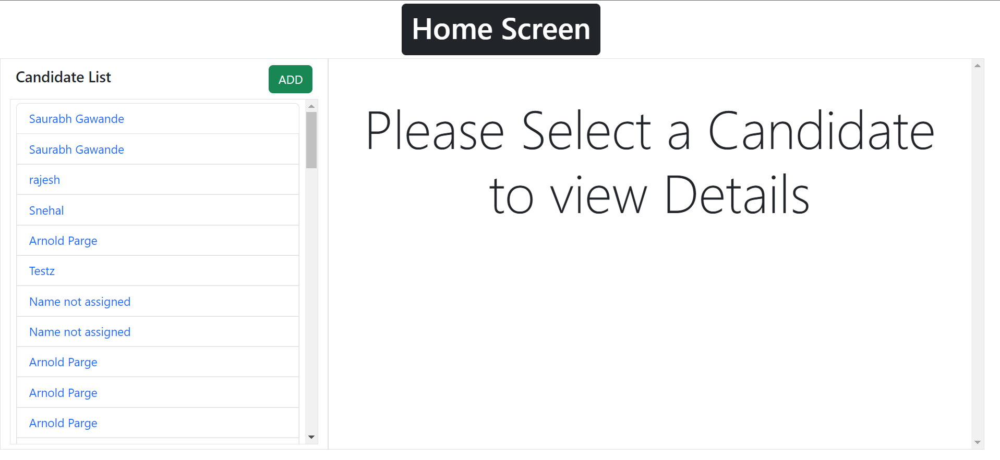

# Creating a Candidate Dashboard App with React

This project was bootstrapped with [Create React App](https://github.com/facebook/create-react-app).

## Available Scripts

In the project directory, you can run:

### `npm install`

### `npm start`

Runs the app in the development mode.\
Open [http://localhost:3000](http://localhost:3000) to view it in your browser.

The page will reload when you make changes.\
You may also see any lint errors in the console.

## Table of contents

- [Overview](#overview)
  - [The challenge](#the-challenge)
  - [Screenshot](#screenshot)
  - [Links](#links)
- [My process](#my-process)
  - [Built with](#built-with)
- [Author](#author)

## Overview

### The challenge

Users should be able to:

- Login via their Google Account
- See the list of candidates
- On Clicking be able to view the details of the selected candidate
- An ADD button to create a new candidate
- An Edit button to Edit the exisiting candidate details
- A delete Button to delete a selected candidate

### Screenshot

Home Screen

New Form

Candidate Details

Edit Details

### Links

- Solution URL: [Source Code](https://github.com/zaidansari42/candidate-dashboard)
- Live Site URL: [Candidate App](https://canididates.netlify.app)

### Built with

- React App
- CSS custom properties
- BootStrap 5.2
- React Routing
- Flexbox

## Author

- Website - [Zaid Ansari](https://zaidansari42.netlify.app/)
- LinkedIn- [@zaidansari42](https://www.linkedin.com/in/zaid42/)
- Twitter - [@zaidansari42](https://www.twitter.com/zaidansari42)
